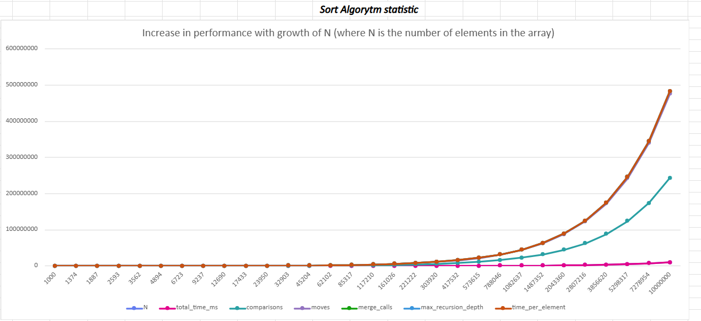

# Optimized Sort Algorytm

This project contains a highly optimized implementation of merge sorting written in **TypeScript**.

- Worst case => O(n log n)

- Good case => O(n)

## Features
- Recursion-based divide & conquer strategy
- Multiple optimizations:
- Early exit when left max ≤ right min
- Small-overlap optimized merge
- Preallocated merge buffer
- No spread operators, no splice slow-path

## Installation
```bash
npm install
```
## Statistic
#### N - random values array length (horizontal)
